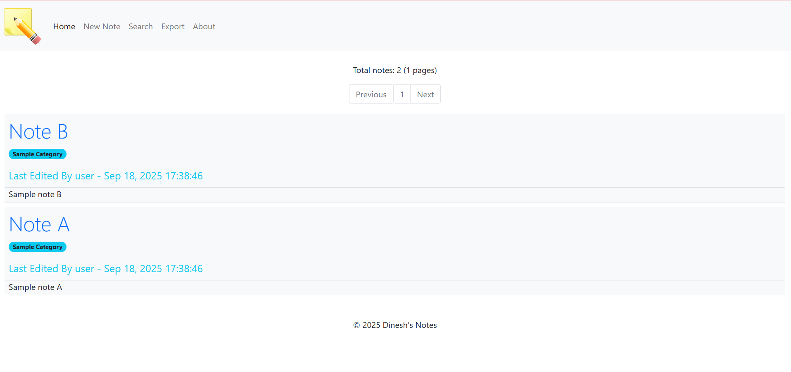
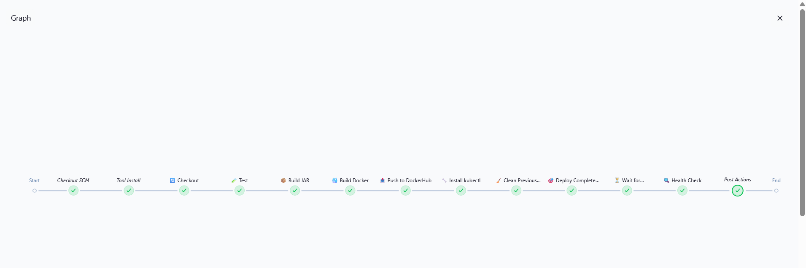
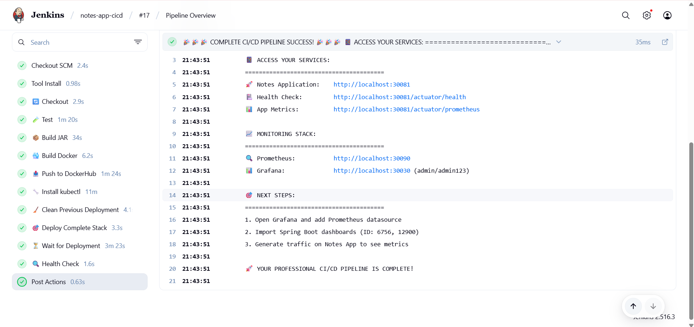
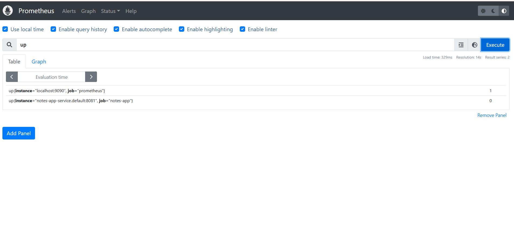
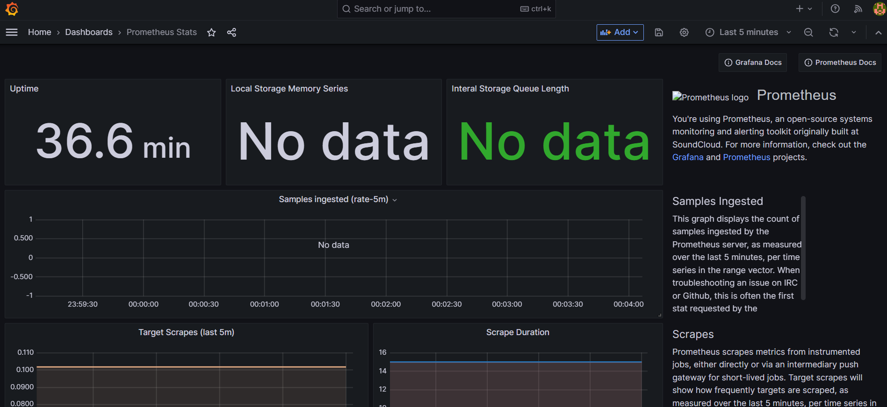
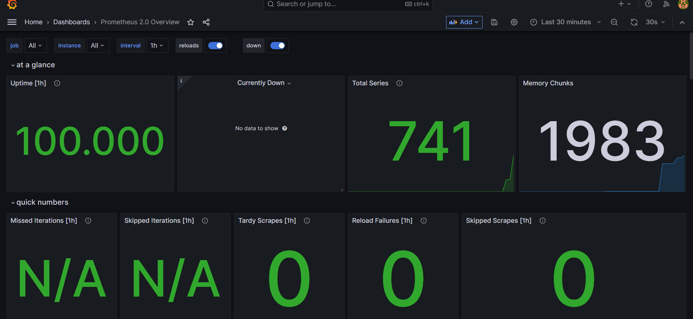

🚀 SPRING BOOT NOTES APP WITH DEVOPS PIPELINE
Complete CI/CD Pipeline with Kubernetes, Docker, Jenkins & Monitoring
📋 Project Overview
A Spring Boot Notes application with rich-text editing capabilities, deployed on Kubernetes with complete DevOps automation including CI/CD pipeline and monitoring stack.

🏗️ Technology Stack
Application:

✅ Spring Boot 2.6.10 - Core framework

✅ Spring Security - Authentication

✅ Spring Data JPA - Data persistence

✅ SQLite Database - Data storage

✅ Thymeleaf - Templating engine

✅ QuillJS - Rich-text editor

✅ Maven - Build tool

DevOps Infrastructure:

✅ Docker - Containerization

✅ Kubernetes - Container orchestration

✅ Jenkins - CI/CD pipeline

✅ Prometheus - Monitoring

✅ Grafana - Dashboards

✅ GitHub - Source control

🚀 Quick Start
Local Development
bash
git clone [your-repo-url]
cd springboot-notes-app-ci
mvn clean package
java -jar target/notes-app.jar

# Access: http://localhost:8081
# Login: admin/admin123
Full DevOps Stack
bash
# Deploy everything
kubectl apply -f full-stack.yaml

# Access URLs:
# Notes App: http://localhost:30081
# Jenkins: http://localhost:8080  
# Prometheus: http://localhost:30090
# Grafana: http://localhost:30030 (admin/admin123)

🎯 Application Features
✅ Create, Edit, Delete notes with rich-text editor

✅ User Authentication with Spring Security

✅ Category Management for organizing notes

✅ Search Functionality by content and category

✅ PDF Export capabilities

✅ Responsive UI with Bootstrap

🔧 CI/CD Pipeline
✅ GitHub Integration - Webhook triggers

✅ Automated Testing - Maven unit tests

✅ Docker Build - Multi-stage containerization

✅ Kubernetes Deploy - Automated deployment

✅ Health Checks - Application monitoring

📊 Monitoring Stack
✅ Prometheus - Metrics collection

✅ Grafana - Visualization dashboards

✅ Application Metrics - Spring Boot actuator

✅ Infrastructure Monitoring - Kubernetes metrics

📁 Project Structure
text
springboot-notes-app-ci/
├── src/main/java/           # Application source
├── src/main/resources/      # Configuration files
├── src/test/java/          # Unit tests
├── Dockerfile              # Container build
├── Jenkinsfile            # CI/CD pipeline
├── full-stack.yaml        # Kubernetes deployment
└── pom.xml               # Maven configuration

🎖️ What This Demonstrates
✅ Complete CI/CD Pipeline - GitHub to Production

✅ Container Orchestration - Kubernetes deployment

✅ Infrastructure as Code - Declarative deployments

✅ Monitoring & Observability - Prometheus + Grafana

✅ Modern Web Development - Spring Boot + Rich UI

---

### **📸 Screenshots**

#### **🚀 Notes Application Interface**

#### **🔧 Jenkins CI/CD Pipeline** 

#### **📊 Prometheus Monitoring**

#### **📈 Grafana Dashboard**

